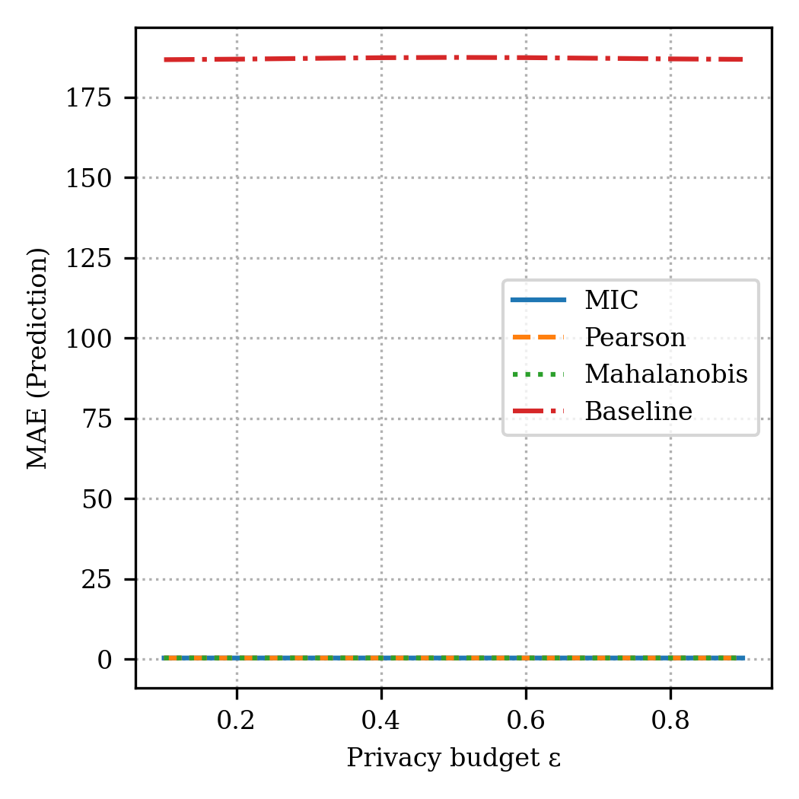

# mic_dp: Maximum Information Coefficient Differential Privacy

`mic_dp` is a Python package that enables differentially private data transformation guided by the *Maximum Information Coefficient* (MIC), with application to both supervised and unsupervised learning tasks. Traditional differential privacy (DP) mechanisms often degrade utility uniformly across features. In contrast, `mic_dp` uses MIC to scale the noise injection, preserving more utility in informative features.

## Summary

This package includes functions for:
- Calculating MIC, Pearson, and Mahalanobis-based feature relevance
- Feature selection based on scaled importance
- Applying Gaussian or Laplace DP mechanisms using custom noise scaling
- Evaluating MAE, clustering scores, and plotting results

The library has been evaluated using:
1. **ACI Dataset (Adult Census Income)** from the UCI repository for supervised learning. This dataset includes demographic features used to predict income classes.
2. **Household Electricity Demand (HED)** dataset from the 2009 Midwest RECS dataset for unsupervised learning. This time series dataset provides daily electricity consumption profiles across households.

Our experiments show that MIC-guided DP mechanisms consistently outperform Pearson, Mahalanobis, and baseline DP in terms of feature and prediction accuracy under privacy constraints. In unsupervised settings, MIC-DP preserves cluster structures better, as shown by silhouette score, ARI, and V-measure.

## Installation

You can install the package directly from PyPI:

```bash
pip install mic-dp
```

Or install from source:

```bash
git clone https://github.com/merlery/mic_dp.git
cd mic_dp
pip install -e .
```

## Quick Start

Here's a simple example of how to use `mic_dp` for supervised learning:

```python
import pandas as pd
import numpy as np
from sklearn.preprocessing import MinMaxScaler
from mic_dp.core import (
    noise_scaling_MIC, 
    calculate_sensitivity, 
    correlated_dp_gaussian,
    mean_absolute_error
)

# Load and preprocess your data
df = pd.read_csv('your_dataset.csv')
df.dropna(inplace=True)
X = df.select_dtypes(include=['number'])
X_norm = pd.DataFrame(MinMaxScaler().fit_transform(X), columns=X.columns)
y = df['target_column']  # Your target variable

# Calculate MIC-based noise scaling factors
noise_factors = noise_scaling_MIC(y, X_norm, amplification_factor=5)

# Calculate sensitivity for each feature
sensitivity = calculate_sensitivity(X_norm)

# Apply differential privacy with MIC-guided noise scaling
private_X = correlated_dp_gaussian(
    X_norm.copy(), 
    noise_factors, 
    sensitivity, 
    epsilon=0.5,  # Privacy budget
    delta=1e-5    # Privacy relaxation parameter
)

# Evaluate the utility loss
mae = mean_absolute_error(X_norm, private_X)
print(f"Mean Absolute Error: {mae:.4f}")
```

## Detailed Example

For a more comprehensive example, see the [supervised_experiment.py](examples/supervised_experiment.py) script, which demonstrates:

1. Loading and preprocessing the Adult Census Income dataset
2. Calculating feature relevance using MIC, Pearson, and Mahalanobis methods
3. Applying differential privacy with different noise scaling strategies
4. Evaluating and comparing the utility of each approach
5. Visualizing the results

To run the example:

```bash
python examples/supervised_experiment.py
```

## Experimental Results

MIC-guided noise scaling consistently outperforms conventional approaches in preserving prediction accuracy and clustering structure under differential privacy constraints.




## API Reference

### Core Functions

- `noise_scaling_MIC(target, features, factor)`: Calculate noise scaling factors based on Maximum Information Coefficient
- `noise_scaling_pearson(target, features, factor)`: Calculate noise scaling factors based on Pearson correlation
- `noise_scaling_mahalanobis_distances(target, features, factor)`: Calculate noise scaling factors based on Mahalanobis distances
- `calculate_sensitivity(features)`: Calculate sensitivity for each feature based on its range
- `correlated_dp_gaussian(X, noise_factors, sensitivity, epsilon, delta)`: Apply Gaussian differential privacy with custom noise scaling
- `correlated_dp_laplace(X, noise_factors, sensitivity, epsilon, delta)`: Apply Laplace differential privacy with custom noise scaling
- `feature_selection(percentage, X, noise_scaling_factor)`: Select features based on their noise scaling factors
- `mean_absolute_error(y_true, y_pred)`: Calculate mean absolute error between true and predicted values
- `cluster_and_evaluate(df, name, n_clusters)`: Perform clustering and evaluate the results
- `calculate_ari(labels1, labels2)`: Calculate Adjusted Rand Index between two cluster labelings
- `calculate_v_measure(labels1, labels2)`: Calculate V-measure between two cluster labelings

## Citation

If you use this package in your research, please cite:

```
@article{yang2025micdp,
  title={mic\_dp: A Python package for maximum information coefficient differential privacy},
  author={Yang, Wenjun and Al-masri, Eyhab and Kotevska, Olivera},
  journal={Journal of Open Source Software},
  year={2025}
}
```

## License

This project is licensed under the MIT License - see the LICENSE file for details.

## Acknowledgements

We acknowledge the creators of the ACI and HED datasets for making their data publicly available.

## References

- Dua, D. and Graff, C. (2019). UCI Machine Learning Repository.
- US Energy Information Administration, Midwest RECS Survey (2009).
