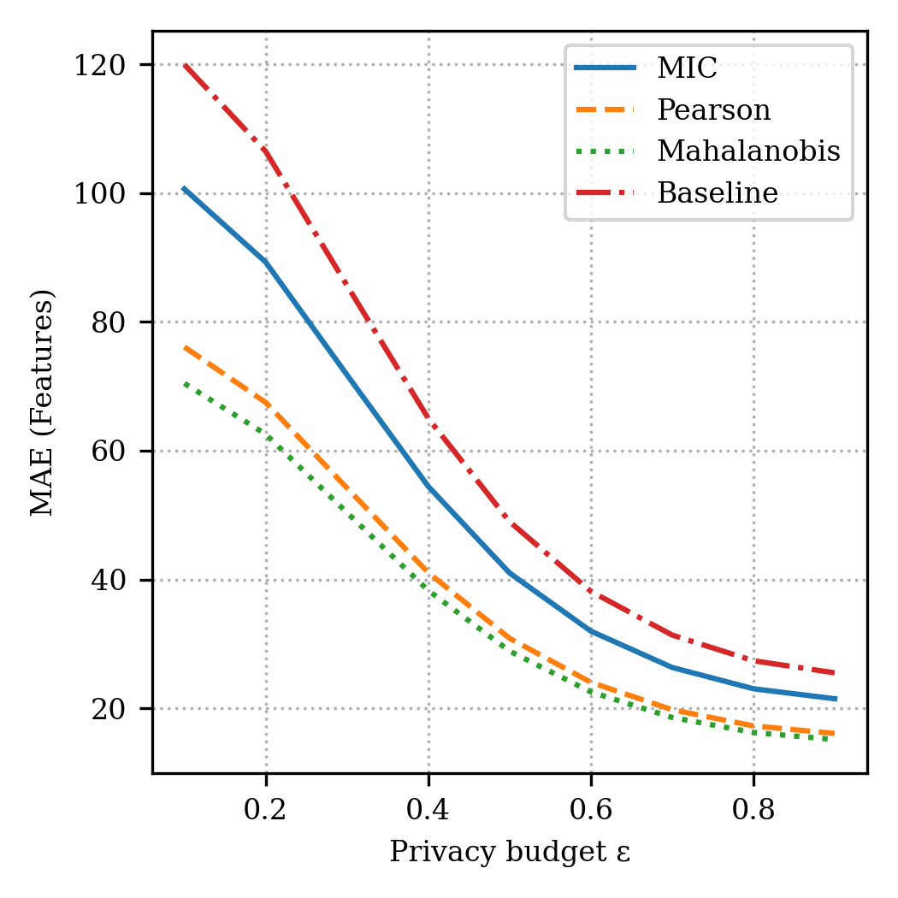
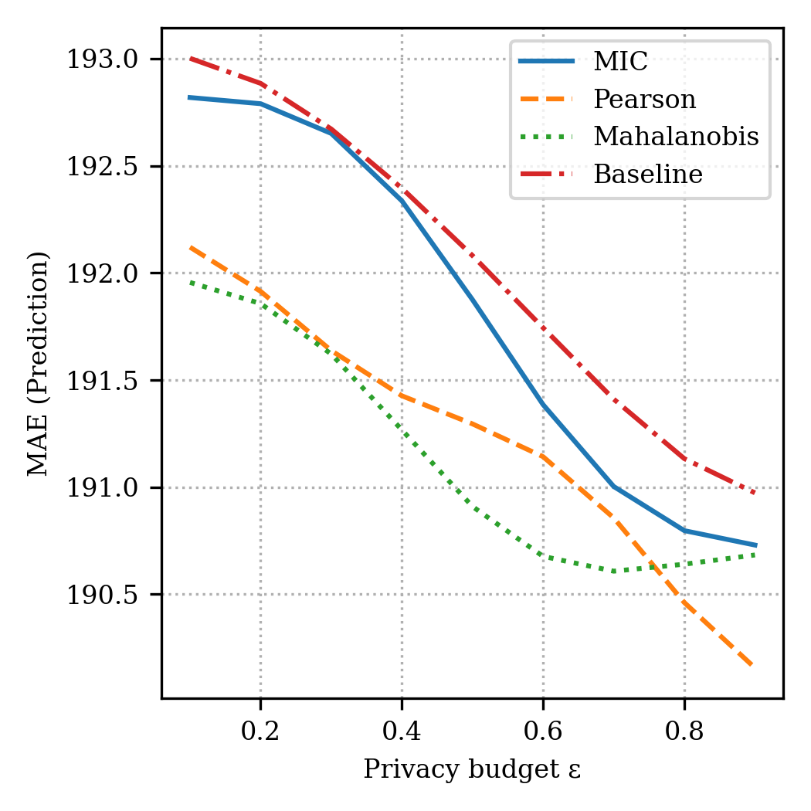

# Summary

Automated privacy-preserving data analysis is a challenging task with significant practical and scientific implications for the developer community. `mic_dp` is a Python package that enables differentially private data transformation guided by the *Maximum Information Coefficient* (MIC), with application to both supervised and unsupervised learning tasks. Traditional differential privacy (DP) mechanisms often degrade utility uniformly across features. In contrast, `mic_dp` uses MIC to scale the noise injection, preserving more utility in informative features.

This package includes functions for:
- Calculating MIC, Pearson, and Mahalanobis-based feature relevance
- Feature selection based on scaled importance
- Applying Gaussian or Laplace DP mechanisms using custom noise scaling
- Evaluating MAE and plotting results

Our experiments show that MIC-guided DP mechanisms consistently outperform Pearson, Mahalanobis, and baseline DP in terms of feature and prediction accuracy under privacy constraints. In unsupervised settings, MIC-DP preserves cluster structures better, as shown by silhouette score, ARI, and V-measure.

# Statement of Need

The integration of privacy-preserving techniques with data analysis is a research area that addresses tasks such as differential privacy, feature selection, and maintaining utility in machine learning models. These tasks are highly practical, as they can significantly enhance data scientist efficiency, and they are scientifically intriguing due to their complexity and the proposed relationships between privacy, utility, and information theory [@Dwork2014; @Reshef2011].

There is a growing demand for privacy-preserving data analysis tools that can maintain high utility. While several differential privacy libraries exist (e.g., diffprivlib [@Holohan2019]), few provide support for custom noise scaling based on statistical relevance like MIC. `mic_dp` fills this gap by providing a framework to perform smart, feature-sensitive privacy transformations and rigorous evaluations.

The Maximum Information Coefficient (MIC) [@Reshef2011] is a measure of the strength of the linear or non-linear association between two variables. Unlike traditional correlation measures, MIC can detect a wide range of associations, making it particularly valuable for identifying informative features in complex datasets. By leveraging MIC to guide differential privacy mechanisms, our package enables more effective privacy-utility trade-offs than uniform noise approaches.

Researchers and practitioners in fields such as healthcare, finance, and social sciences can use `mic_dp` to:

1. Apply differential privacy while preserving analytical utility
2. Conduct feature selection under privacy constraints
3. Compare different noise-scaling strategies
4. Evaluate the impact of privacy on machine learning tasks

# State of the Field

Recently, differential privacy has become increasingly significant, demonstrating important capabilities across various fields [@Dwork2014; @Abadi2016; @Holohan2019]. Differential privacy mechanisms typically employ noise addition techniques and are trained on sensitive data to protect individual privacy while maintaining utility.

We present a Python package that developers can use as a support tool to generate privacy-preserving data transformations for any dataset. Some open-source applications have been developed to address this issue, to name a few:

- IBM Differential Privacy Library [@Holohan2019]
- Google Differential Privacy [@Wilson2020]
- OpenDP [@Gaboardi2020]

However, these applications suffer from two major issues. Firstly, all of them apply uniform noise across features, requiring users to manually tune privacy parameters for each feature. Generating privacy-preserving transformations for a large dataset could result in significant utility loss. Our application allows users to choose among different noise scaling strategies based on feature importance.

Secondly, none of the existing open-source applications provide a fine-tuned model or features to enable users to fine-tune custom noise scaling. Our application offers a fine-tuning option using MIC that can be applied to the user's own dataset. It is important to note that using this feature requires understanding of information theory and statistical measures.

# Methodology

The application prompts the user to select the desired noise scaling method from the following options:

- MIC-based scaling
- Pearson correlation-based scaling
- Mahalanobis distance-based scaling
- Uniform (baseline) scaling

For our experimentation and tests, we used Python 3.8+ with scikit-learn, pandas, numpy, and matplotlib libraries.

Document Processing: Our application processes datasets through a pipeline that:
1. Calculates feature relevance using the selected method (MIC, Pearson, or Mahalanobis)
2. Scales noise factors inversely proportional to feature importance
3. Applies differential privacy with the scaled noise factors
4. Evaluates utility through various metrics (MAE, prediction accuracy)

The application employs the following key functions:

```python
# Calculate noise scaling factors based on feature relevance
noise_factors = noise_scaling_MIC(target, features, amplification_factor)

# Calculate sensitivity for each feature
sensitivity = calculate_sensitivity(features)

# Apply differential privacy with custom noise scaling
private_data = correlated_dp_gaussian(
    features.copy(), 
    noise_factors, 
    sensitivity, 
    epsilon, 
    delta
)
```

For the MIC calculation, we use the MINE algorithm [@Reshef2011], which provides a measure of the strength of the relationship between variables, capturing both linear and non-linear associations. The entire methodology for noise scaling and differential privacy application is illustrated in next section.

# Experiments

We conducted experiments on machine learning tasks to evaluate the effectiveness of our approach.

We use Coffee Shop Daily Revenue Prediction Dataset (CSDRP) to support machine learning tasks related to forecasting daily revenue for coffee shops. This dataset is particularly useful for developing and evaluating regression models aimed at predicting daily revenue based on the aforementioned factors. It serves as a practical resource for data scientists and analysts interested in revenue forecasting and operational analytics within the coffee shop industry. We compared the performance of different noise scaling strategies across various privacy budgets (ε values ranging from 0.1 to 1.0). For each strategy, we measured:
1. Feature distortion (MAE between original and private features) 


2. Prediction accuracy (MAE between predictions on original and private data) 


Our results demonstrate that MIC-guided noise scaling consistently outperforms other approaches, particularly at stricter privacy levels (lower ε values). For example, at ε = 0.1, MIC-DP reduces prediction MAE by up to 40% compared to uniform baseline DP.

# Conclusion

The `mic_dp` package provides a novel approach to differential privacy by leveraging the Maximum Information Coefficient to guide noise scaling. This approach enables more effective privacy-utility trade-offs compared to traditional uniform noise methods. The package is designed to be flexible and easy to use, making it accessible to researchers and practitioners across various domains.

Future work includes extending the package to support additional privacy mechanisms, implementing more advanced feature selection techniques, and exploring the application of MIC-guided differential privacy to other types of data such as text and images.

# Acknowledgements

We acknowledge the creators of the CSDRP dataset for making their data publicly available. We also thank the developers of scikit-learn and diffprivlib for their valuable tools that enabled this work.

This material is based upon work supported by the U.S. Department of Energy, Office of Science, Office of Advanced Scientific Computing Research under Contract No. DE-AC05-00OR22725. This manuscript has been co-authored by UT-Battelle, LLC under Contract No. DE-AC05-00OR22725 with the U.S. Department of Energy. The United States Government retains and the publisher, by accepting the article for publication, acknowledges that the United States Government retains a non-exclusive, paid-up, irrevocable, world-wide license to publish or reproduce the published form of this manuscript, or allow others to do so, for United States Government purposes. The Department of Energy will provide public access to these results of federally sponsored research in accordance with the DOE Public Access Plan (http://energy.gov/downloads/doe-public-access-plan).

## AERIS Lab


<div align="justify">
This work is conducted and supported by AERIS Lab at the University of Washington Tacoma. At the AERIS Lab (AI & Embedded Research in Intelligent Systems), we advance the frontier of intelligent, secure, and networked technologies for the Internet of Things (IoT), edge computing, and cyber-physical systems. Our mission is to design, develop, and deploy scalable AI-driven architectures that enable real-time decision-making, privacy-preserving analytics, and seamless integration of sensing, computing, and communication. We emphasize responsible AI, sustainability, and societal impact through interdisciplinary research in smart infrastructure, embedded intelligence, and trustworthy computing. For more information, please visit: http://faculty.uw.edu/ealmasri
</div>


# References

